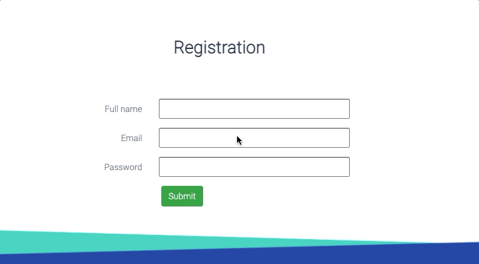
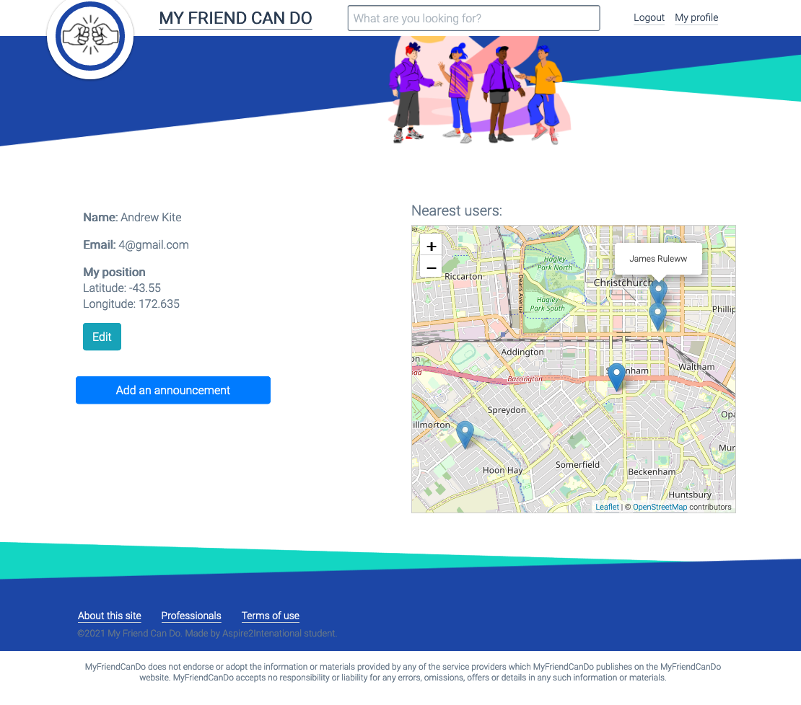
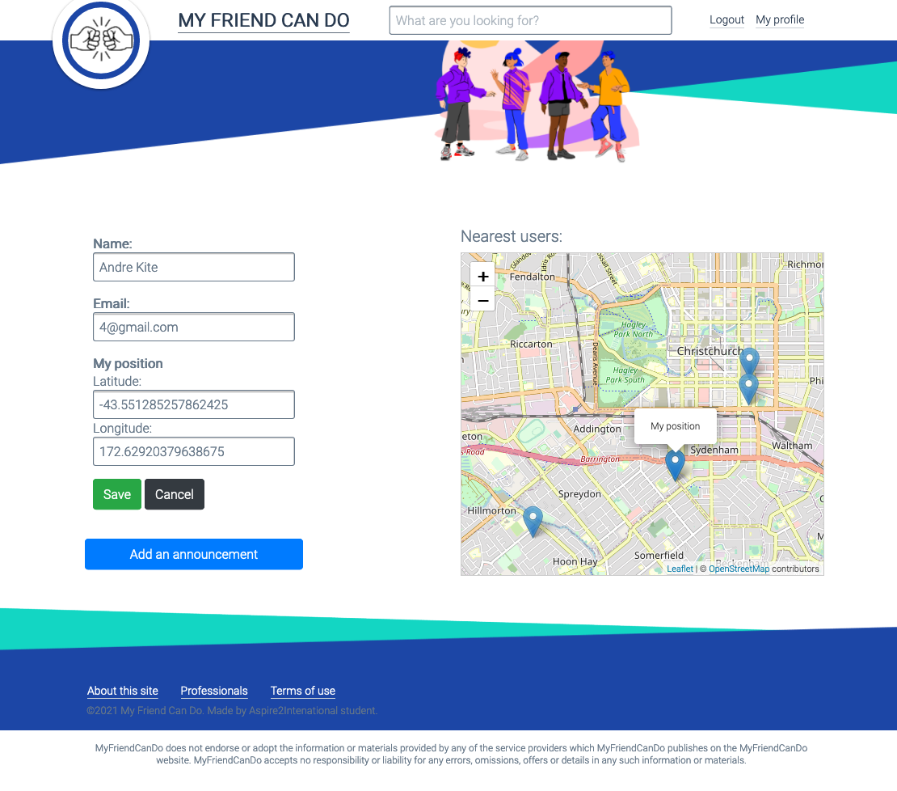
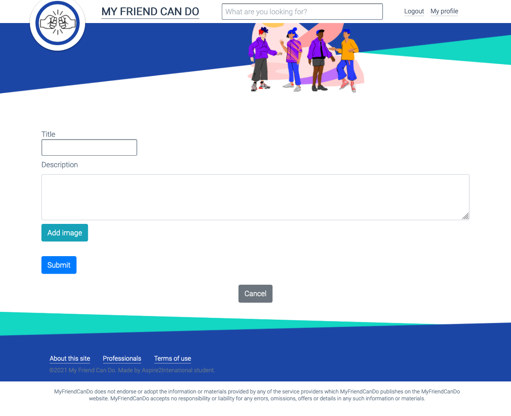
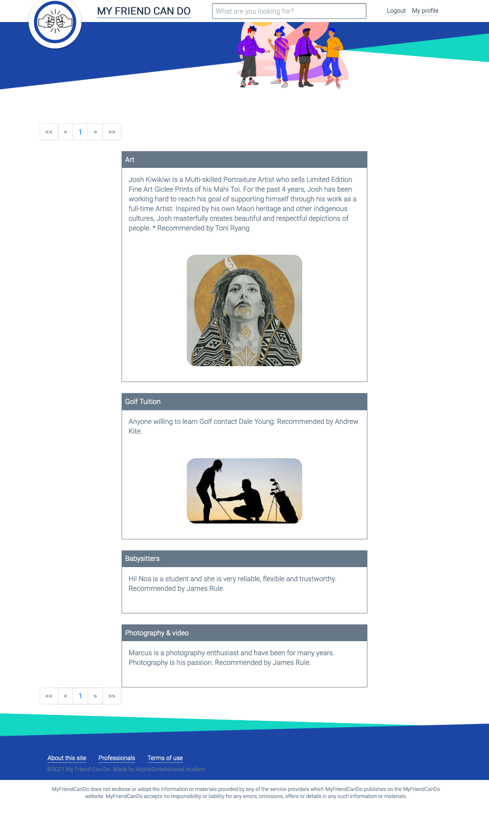

# MFCD
 A repository to perform Project STD702 System Development Integration

#### Main page

  

#### Registration
- Register page

  

- JS Validation

  

- Sign in page

  

#### User role
- Profile

  

- Edit profile

  

- Add announcement

  

- All posts

  

